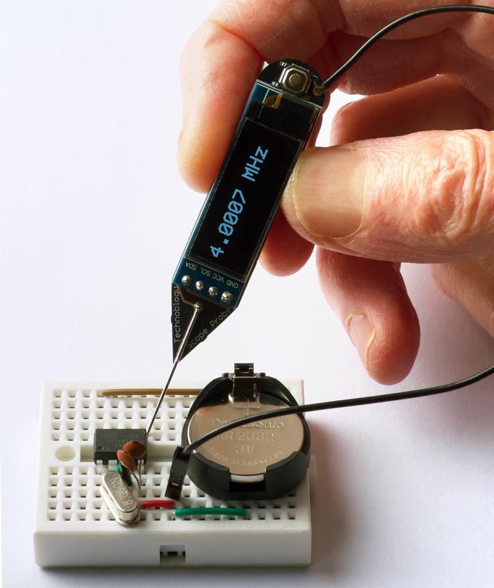
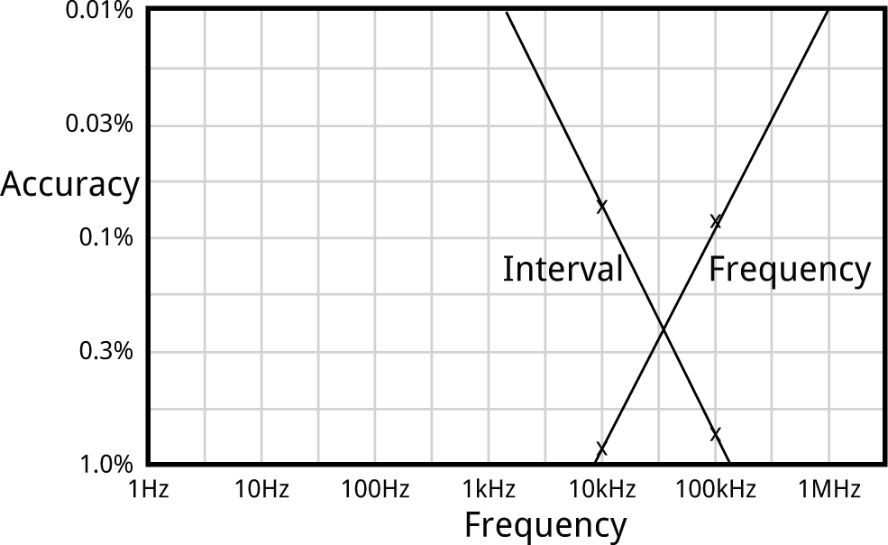
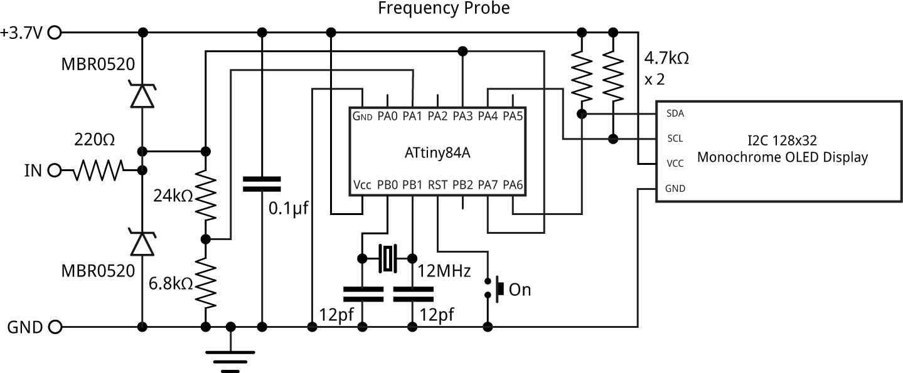
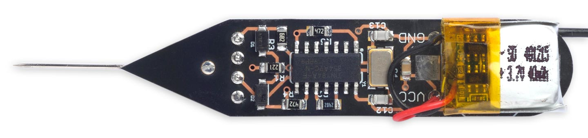

## Frequency Probe

7th December 2020

The Frequency Probe is a handheld tool designed to help you debug your circuits by giving a visual indication of the frequency or voltage at the probe. For a periodic waveform it gives a digital readout of the frequency, with a range of about 1Hz to 5MHz and an accuracy of better than 0.3%. For a voltage level it gives a readout of the voltage:

{:height="100px" width="50px"}

*Using the Frequency Probe to check the frequency generated by a 4MHz crystal oscillator.*

It is based on an ATtiny84A, and is powered from a small Lipo cell.

### Introduction

The obvious way to implement a frequency meter is to count the number of pulses within one second; this then directly gives the frequency. I refer to this as **Frequency Mode**. The disadvantage of this method is that a long sample time is needed to measure low frequencies accurately.

The other way is to measure the interval between two pulses of the input signal; the reciprocal of this then gives the frequency. I call this **Interval Mode**. For example, if the interval between pulses is one second the frequency is 1Hz. The disadvantage of this method is that for high frequencies you need to measure the interval very accurately.

The ideal solution is to use Frequency Mode for high frequencies, and Interval Mode for low frequencies, which is the approach I've adopted with the Frequency Probe. I explain below how to calculate the best point at which to switch between modes.

I originally started work on this project a couple of years ago, but it turned out to be a lot trickier than I anticipated, and so decided to put it to one side. I revisited it earlier this year, and fortunately managed to solve all the issues.

#### Processor

I chose the ATtiny84 for this project because it has an 8-bit Timer/Counter0, which you can clock from an external signal on T0, providing an accurate way of measuring an external frequency. It also has a 16-bit Timer/Counter1 with input capture, which copies the contents of the counter to a register on the rising or falling edge of the input capture pin, ICP1. This allows you to time the period of a waveform very accurately.

It uses the USI peripheral to drive an I2C OLED display and display the readings in double-sized characters, using a 6x8 pixel character font.

#### Frequency range

The upper limit of the frequency you can measure in Frequency Mode is determined by the maximum frequency you can sample on the T0 input. The datasheet specifies that this is clk/2.5, where clk is the processor frequency. At a supply of 3V the maximum processor clock is about 12MHz, giving a upper measurable frequency of 4.8MHz.

In Interval Mode the lower frequency limit is determined by how long you're prepared to wait for the answer; I chose 1Hz, giving readings that are updated on the display once a second.

#### Accuracy

In **Frequency** mode the resolution accuracy of the measured frequency increases with frequency, since there are more sample cycles in the sample. In the program described below I use Timer/Counter0 to count cycles up to an interrupt from Timer/Counter1. This is clocked at the 12MHz system clock frequency divided by 16384 x 8, giving an interrupt 91.6 times a second. The resolution of a frequency measurement at frequency f is therefore:

100 x 12000000 / (8 x 16384 x f) %

For example, at 100kHz the resolution accuracy is 0.09%.

In **Interval** mode accuracy decreases with frequency, since there are fewer timer cycles between the two transitions. In the program I use Timer/Counter1's input capture to measure the interval between two transitions in the input waveform. The resolution of a frequency measurement at frequency f is therefore:

100 x f / 12000000 %

For example, at 10kHz the resolution accuracy is 0.083%.

Here is a graph showing these points, and the overall accuracy of each method:

The best accuracy is defined by where the lines cross, which is achieved by using **Interval** mode for frequencies below 30kHz, and **Frequency** mode above that; this gives an accuracy of better than about 0.3% over all frequencies.

#### Voltage meter

If there's a steady voltage at the probe, the Frequency Probe displays the voltage, from 0 to 5V, with an accuracy of one part in 1024, or 0.1%.

The voltage is read at the analogue input ADC1. The ADC uses the internal 1.1V reference, so a potential divider is used to bring the 0 to 5V input range down to 0 to 1.1V.

#### Testing the circuit

To test the probe with high frequencies I used my [Programmable Signal Generator](</show?26SM>) to generate frequencies from 5MHz down to 1kHz. For lower frequencies I used my [Tiny Function Generator](</show?20W6>) for frequencies down to 1Hz, and I checked the frequencies against the frequency range on my digital multimeter.

### Circuit

Here's the circuit:

*Circuit of the Frequency Probe, based on an ATtiny84.*

#### [► Parts list](<javascript:void(0)>)

<table border="0"><tbody><tr><td><strong>Qty</strong></td><td><strong>Item</strong></td><td><strong>Value</strong></td><td><strong>Size</strong></td><td><strong>Typical parts</strong></td></tr><tr><td>2</td><td>Ceramic capacitor</td><td>12pF</td><td>0805</td><td>As required by crystal</td></tr><tr><td>1</td><td>Ceramic capacitor</td><td>100nF</td><td>0805</td><td></td></tr><tr><td>1</td><td>SMD resistor</td><td>220Ω</td><td>0805</td><td>5%</td></tr><tr><td>1</td><td>SMD resistor</td><td>6.8kΩ</td><td>0805</td><td>5%</td></tr><tr><td>1</td><td>SMD resistor</td><td>24kΩ</td><td>0805</td><td>5%</td></tr><tr><td>2</td><td>SMD resistor</td><td>4.7kΩ</td><td>0805</td><td>5%</td></tr><tr><td>1</td><td>Microcontroller</td><td>ATtiny84</td><td>SOIC</td><td><a href="https://uk.farnell.com/microchip/attiny84a-ssf/mcu-8bit-avr-20mhz-soic-14/dp/2809926" target="_blank">ATtiny84A-SSF</a></td></tr><tr><td>2</td><td>Schottky Diodes</td><td>MBR0520</td><td>SOD-123</td><td><a href="https://uk.farnell.com/on-semiconductor/mbr0520lt1g/diode-schottky-0-5a-20v-smc/dp/9556915" target="_blank">MBR0520LT1G Schottky Rectifier 20V 500mA</a></td></tr><tr><td>1</td><td>SMD Pushbutton</td><td></td><td></td><td><a href="https://www.sparkfun.com/products/8720" target="_blank">Mini Pushbutton Switch - SMD</a></td></tr><tr><td>1</td><td>Crystal</td><td>12MHz</td><td>5x3.2mm</td><td><a href="https://uk.farnell.com/abracon/abm3baig-12-000mhz-12-4-t/crystal-aec-q200-12mhz-12pf-5x3/dp/2986189" target="_blank">ABM3BAIG-12.000MHz-12-4-T Abracon Crystal 12MHz&nbsp;SMD</a></td></tr><tr><td>1</td><td>OLED display</td><td>I2C 128 x 32</td><td>0.91"</td><td><a href="https://www.aliexpress.com/item/5pcs-0-91-inch-128x32-I2C-IIC-Serial-Blue-OLED-LCD-Display-Module-0-91-12832/32808724036.html" target="_blank">0.91 inch 128x32 I2C IIC Serial OLED LCD Display Module</a></td></tr><tr><td>1</td><td>Lipo cell cell</td><td>3.7V</td><td>12mm x 15mm</td><td><a href="https://www.amazon.co.uk/gp/product/B0847G2N14/" target="_blank">401215 Lipo 3.7V 40mAh 1S</a></td></tr><tr><td>1</td><td>PCB</td><td>Double-sided</td><td>58.5 x 12.8mm</td><td></td></tr></tbody></table>

The input, IN, corresponds to the tip of the probe. A separate flying lead from GND connects to the GND of the circuit you are testing.

The probe input is protected from voltages above Vcc, or negative voltages below GND, by the 220Ω resistor and the two Schottky diodes. It is then fed to the T0 input (PA3) for Frequency Mode, ICP input (PA7) for Interval Mode, and ADC1 (PA1) via a potential divider for Voltage Mode. With 5V on the probe the potential divider gives 6800 / (6800 + 24000) x 5 = 1.10 V at PA1 to match the 1.1V reference used in Voltage Mode. The potential divider is designed to match the ADC input, which is optimised for an input impedance of 10kΩ or less.

When using the USI peripheral to provide an I2C interface it's not possible to use the internal pullups on SCL and SDA, so the circuit provides external pullups of 4.7kΩ.

The only remaining components are the crystal circuit, and a pushbutton to reset the processor and bring it out of sleep.

### Construction

I first tested the design on a prototyping board using through-hole components. For the final version I designed a board in Eagle and sent it to OSH Park for fabrication, using their After Dark service which gives clear soldermask on a black substrate, so you can see the copper tracks. There's a link to the Eagle files or OSH Park project at the end of the article if you want to make yourself a board.

The ATtiny84A is in an SOIC package, and the resistors, capacitor, and diodes are all 0805 size, so they should be relatively easy to solder by hand. The crystal is 5x3.2mm. The display is an OLED 128x32 I2C display module using the SSD1306 driver. I used a low-cost module from AliExpress <a href="#cite_note1">[1]</a>

. I used an ordinary dressmaking pin as the probe.

I originally planned to power the circuit from a 3V CR1225 button cell in a surface mount holder, but this didn't prove capable of providing enough current. Fortunately I had also provided connections on the PCB for a Lipo battery, so I used a 40mAh cell that fits in the same space, attached to the board with a double-sided self-adhesive foam pad:

*Component side of the Frequency Probe.*

You can recharge it in situ using a Lipo charger such as Adafruit's <a href="#cite_note2">[2]</a>

. To save the need for an on/off switch the circuit automatically goes to sleep after 30 seconds; to wake it up you press the push button.

I used a Youyue 858D+ hot air gun at 250°C to solder the SMD components onto the back of the board. I held the display in place on the front of the board with a double-sided self-adhesive foam pad, and then soldered it using four terminal pins, trimmed down flush with the board. If you don't have a hot air gun you should be able to solder the SMD components with a bit of care using a fine-tipped soldering iron.

### The program

The program consists of a display interface, to control the OLED display, the routines to implement the three modes, and a main loop which selects which mode to use for a given input signal.

The display interface uses the same routines as my earlier [Tiny Function Generator](</show?20W6>), which used a similar I2C OLED display. Text is plotted on the display using a 6x8 pixel character set, but at double the scale to give an effective character size of 12x16 pixels, using the smoothing routine I described in [Smooth Big Text](</show?3AJ7>).

The current mode is determined by a variable **Mode**, which has the constant value INTERVAL in Interval Mode, and FREQUENCY in Frequency Mode. The circuit starts in Frequency Mode.

The program first configures Timer/Counter0, TimerCounter1, the Watchdog Timer, and the ADC:

<pre>  // Set up 8-bit Timer/Counter0
  TCCR0A = 0&lt;&lt;WGM00;                      // Normal mode, no waveform output
  TCCR0B = 0&lt;&lt;WGM02 | 0&lt;&lt;CS00;            // Clock stopped
  OCR0A = 255;                            // Compare match at top
  TIMSK0 = 0;                             // Interrupts initially off
  //
  // Set up 16-bit Timer/Counter1
  TCCR1A = 0&lt;&lt;WGM10;                      // No waveform output
  TCCR1B = 1&lt;&lt;WGM12 | 1&lt;&lt;ICES1 | 0&lt;&lt;CS10; // CTC mode, rising edge, clock stopped
  TIMSK1 = 0;                             // Interrupts initially off
  //
  // Set up Watchdog timer for 1 Hz interrupt for display update
  WDTCSR = 0&lt;&lt;WDIE | 3&lt;&lt;WDP0;             // 1/8 second interrupt
  //
  // Set up ADC to use ADC1 (PA1)
  ADMUX = 2&lt;&lt;REFS0 | 1&lt;&lt;MUX0;             // ADC1, 1.1V ref
  ADCSRA = 1&lt;&lt;ADEN | 0&lt;&lt;ADIE | 7&lt;&lt;ADPS0;  // enable ADC, 93.75kHz ADC clock
}</pre>

Initially the Timer/Counter clocks are stopped, the watchdog timer is disabled, and interrupts are turned off.

To run Frequency Mode or Interval Mode the program calls **GetFrequency()** or **GetInterval()** which sets up the peripherals appropriately for each mode.

#### Frequency Mode

The call **GetFrequency()** takes a measurement in Frequency Mode:

<pre>unsigned long GetFrequency () {
  Capture = false;
  FreqHigh = 0;
  TCNT0 = 0;
  TCNT1 = 0;
  OCR1A = 16383;                          // Divide by 16384
  TIFR1 = 1&lt;&lt;OCF1A;                       // Clear compare flag
  TIMSK0 = 1&lt;&lt;OCIE0A;                     // Timer/Counter0 COMPA interrupt
  TIMSK1 = 1&lt;&lt;OCIE1A;                     // Timer/Counter1 COMPA interrupt
  GTCCR = 1;                              // Clear prescaler
  TCCR1B = TCCR1B | 2&lt;&lt;CS10;              // Start clock, /8
  TCCR0B = TCCR0B | 7&lt;&lt;CS00;              // Start external clock on T0 rising edge
  while (!Capture);                       // Wait for Timer/Counter1 timeout
  TCCR1B = TCCR1B &amp; ~(2&lt;&lt;CS10);           // Stop clock
  TCCR0B = TCCR0B &amp; ~(7&lt;&lt;CS00);           // Stop clock
  return Count;
}</pre>

It first clears the counters, enables the Timer/Counter interrupts, and sets up the 8-bit Timer/Counter0 to be clocked via the input signal at the external clock input, T0 (PA3).

To get a 16-bit count we generate a compare interrupt when the Timer/Counter0 register overflows, and count the overflows in the variable **FreqHigh** (we can't use the more logical TIM0\_OVF\_vect interrupt vector because it's already used by the Arduino core):

<pre>ISR(TIM0_COMPA_vect) {
  FreqHigh++;
}</pre>

The 16-bit Timer/Counter1 is set to 1/8 of the system clock. With the OCR1A value of 16383 this gives a compare interrupt every 16384 x 8 cycles, or a frequency of 91.6Hz.

The interrupt service routine turns off the Timer/Counter interrupts, and sets the variable **Count** to the value obtained by combining the Timer/Counter0 count register and **FreqHigh**:

<pre>ISR(TIM1_COMPA_vect) {
  uint8_t temp = TCNT0;
  TIMSK1 = 0;                             // Turn off interrupt
  TIMSK0 = 0;                             // Turn off interrupt
  Count = (unsigned long)FreqHigh&lt;&lt;8 | temp;
  Capture = true;
}
</pre>

The actual frequency, in Hz, is then given by:

<pre prenum="4"></pre>

where 46875/512 is a good approximation to 91.6Hz.

The routine **PlotFrequency()** is then called to plot the frequency on the display, with the appropriate units:

<pre>void PlotFrequency (unsigned long c, int line) {
  unsigned long f = (c * 46875)/512;
  if (f &gt;= 1000000) {
    PlotValue(f/100, line, Col, 4);
    PlotText(PSTR(" MHz"), line, Col+6*6*Scale);
  } else if (f &gt;= 100000) {
    PlotValue(f/10, line, Col, 2);
    PlotText(PSTR(" kHz"), line, Col+6*6*Scale);
  } else if (f &gt;= 10000) {
    PlotValue(f, line, Col, 3);
    PlotText(PSTR(" kHz"), line, Col+6*6*Scale);
  } else PlotText(PSTR("----------"), line, Col);
}</pre>

#### Interval Mode

The call **GetInterval()** takes a measurement in Interval Mode:

<pre>unsigned long GetInterval () {
  Captures = 0;
  Count = 0;
  IntHigh = 0;
  TCNT1 = 0;
  OCR1A = 65535;                          // Divide by 65536
  TCCR1B = TCCR1B | 1&lt;&lt;CS10;              // Start clock, /1
  TIFR1 = 1&lt;&lt;ICF1 | 1&lt;&lt;TOV1;              // Clear capture and OVF flags
  TIMSK1 = 1&lt;&lt;TOIE1 | 1&lt;&lt;ICIE1;           // Timer/Counter1 OVF + capture interrupts
  DelaySecond();                          // Allow 1 second for captures
  TCCR1B = TCCR1B &amp; ~(1&lt;&lt;CS10);           // Stop clock
  TIMSK1 = 0;                             // Turn off interrupts
  return Count;
}</pre>

This mode only uses Timer/Counter1. It first clears the counter, enables the Timer/Counter capture and overflow interrupts, and sets up counter to be clocked at the system clock rate.

The overflow interrupt increments a variable **IntHigh**:

<pre>ISR(TIM1_OVF_vect) {
  IntHigh++;
}</pre>

The input capture interrupt counts two input captures, and then sets the variable **Count** to the difference between them:

<pre>ISR(TIM1_CAPT_vect) {
  unsigned int temp = ICR1;
  Count0 = Count1;
  Count1 = (unsigned long)IntHigh&lt;&lt;16 | temp;
  Captures++;
  if (Captures == 2) {
    Count = Count1 - Count0;
    TIMSK1 = 0;
  }
}</pre>

If there is no signal on the probe the **GetInterval()** routine would lock up, since no input captures are occurring. So the watchdog interrupt at 8Hz is used to count down the variable **Timer**:

<pre>ISR(WDT_vect) {
  WDTCSR = WDTCSR | 1&lt;&lt;WDIE;
  Timer--;
}</pre>

The routine **DelaySecond()** uses this to generate a one-second delay, and return from **GetInterval()** when this has elapsed:

<pre>void DelaySecond () {
  WDTCSR = WDTCSR | 1&lt;&lt;WDIE;
  Timer = 8;
  while (Timer &gt; 0);
  WDTCSR = WDTCSR &amp; ~(0&lt;&lt;WDIE);
}</pre>

#### Voltage mode

Finally Voltage Mode simply uses the ADC to measure the voltage on the analogue input ADC1:

<pre>unsigned long GetVoltage () { 
  ADCSRA = ADCSRA | 1&lt;&lt;ADSC;              // Start conversion
  while(ADCSRA &amp; 1&lt;&lt;ADSC);                // Wait until complete
  int low, high;
  low = ADCL;
  high = ADCH;
  return high&lt;&lt;8 | low;
}</pre>

#### Main loop

The main loop repeatedly takes readings in the currently selected mode, if necessary switching mode if the reading is out of range for that mode:

<pre>  do {
    if (mode == FREQUENCY) {
      c = GetFrequency();
      if (c &gt; 320) {
        PlotFrequency(c, 1);
        Sleep = Timeout;
        DelaySecond();
      } else if (c == 0) mode = VOLTAGE;
      else mode = INTERVAL;
    } else if (mode == INTERVAL) {
      c = GetInterval();
      if (c &gt; 390) {
        PlotInterval(c, 1);
        Sleep = Timeout;
      } else if (c == 0) mode = VOLTAGE;
      else mode = FREQUENCY;
    } else if (mode == VOLTAGE) {
      c = GetVoltage();
      PlotVoltage(c, 1);
      if (c &lt; 40) Sleep--;
      DelaySecond();
      mode = FREQUENCY;
    }
  } while (Sleep &gt; 0);</pre>

There is some hysteresis in the switching point, to avoid the probe switching between modes for a frequency at the changeover point.

#### Sleep timeout

To avoid the need for an on/off switch, the program times out after approximately 30 seconds if there is no input on the probe, and the voltage is less than 0.20V. It then turns off the display, and puts the processor to sleep. The sleep current consumption is about 7.1µA, which gives a battery life of about a year with a 40mAh Lipo cell. Pressing the push button resets the processor and wakes the probe up.

### Compiling the program

I compiled the program using Spence Konde's ATTiny Core <a href="#cite_note3">[3]</a>

. Choose the **ATtiny24/44/84** option under the **ATTinyCore** heading on the **Board** menu. Then check that the subsequent options are set as follows (ignore any other options):

**Chip: "ATtiny84"** 

**Clock: "12 MHz (external)" 

****B.O.D: Level: "B.O.D. Disabled"** 

**Pin Mapping: "Clockwise (like damellis core)"**

I connected to the ATtiny84 using a Pomona test clip that fitted to the top of the chip <a href="#cite_note4">[4]</a>

, using the Sparkfun Tiny AVR Programmer <a href="#cite_note5">[5]</a>

. Choose **Burn Bootloader** to set the fuses appropriately, then choose **Upload** to upload the program.

Here's the whole Frequency Probe program: [Frequency Probe Program](</list?3CC3>).

Alternatively, get it on GitHub here together with the Eagle files for the PCB: [Frequency Probe on GitHub](<https://github.com/technoblogy/frequency-probe>).

Or order yourself a board from OSH Park here: [Frequency Probe](<https://oshpark.com/shared_projects/LONUeIYC>).

Note that the PCB still has the footprint for the unused button cell; you could remove this if you prefer.

### Further suggestions

It would be quite easy to add a display showing the mark/space ratio in Interval Mode; in fact I had this working on an early prototype. What you need to do is take three readings in the input capture interrupt service routine, switching the input capture edge between readings by changing ICES1 in register TCCR1B.

You could increase the upper frequency limit of the frequency probe to 8MHz by running the ATtiny84 from a 20MHz external crystal. To do this you'd need to power it from at least 4.5V.

---

1. [^](<#cite_ref1>) [0\.91 inch 128x32 I2C IIC Serial OLED LCD Display Module](<https://www.aliexpress.com/item/5pcs-0-91-inch-128x32-I2C-IIC-Serial-Blue-OLED-LCD-Display-Module-0-91-12832/32808724036.html>) on AliExpress.
2. [^](<#cite_ref2>)[Adafruit Micro-Lipo Charger](<https://www.adafruit.com/product/1904>) on Adafruit.
3. [^](<#cite_ref3>)[ATTinyCore](<https://github.com/SpenceKonde/ATTinyCore>) on GitHub.
4. [^](<#cite_ref4>)[IC Test Clip SOJ SOIC 14 Contacts](<https://uk.farnell.com/pomona/5251/test-clip-14-pos-1-27mm-soj-soic/dp/2406244>) on Farnell.
5. [^](<#cite_ref5>)[Tiny AVR Programmer](<https://www.sparkfun.com/products/11801>) on Sparkfun.

<!-- -->

